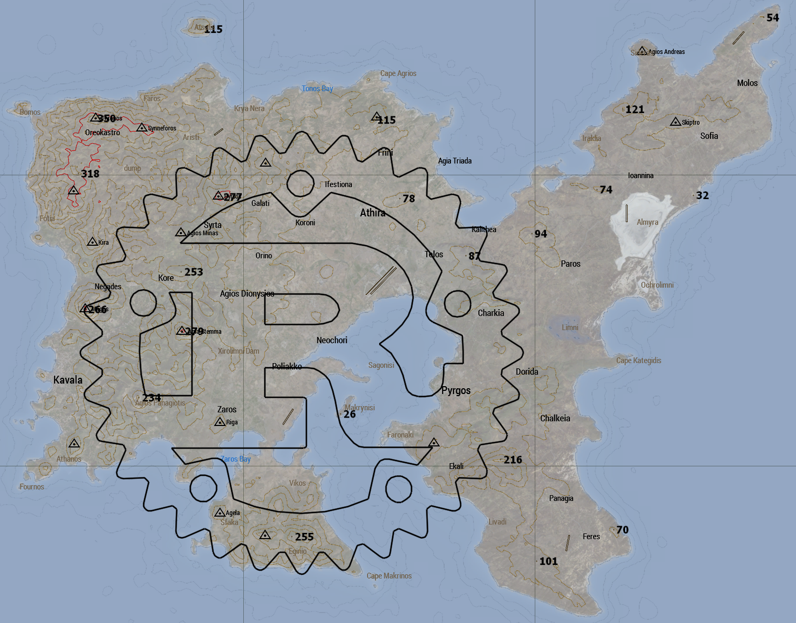

# Automatic Arma 3 map art

## Requirements
To build you will need the rust compiler or preferably cargo. Get it [here](https://www.rust-lang.org/)  
To run you will need AutoHotkey. Get it [here](https://www.autohotkey.com/)

## Description
This application generates Auto Hot Key scripts from .svg files to draw
on the Arma 3 in game map. 

## Usage
Build or use a prebuilt version and run it with the desired flags.  
Then run the generated .ahk script as administrator.  
Arma 3 seems to block AutoHotkey from reading your input, so tab out of Arma, press control + b, tab back in 
and see a bounding box be drawn. Play around with the scale and offset parameters until the box is in a desirable
position.
Repeat the tab out process, but press control + z to start the drawing process.
To stop the process, hit the escape key. 

## Flags:

##### Mandatory:
* -s \<SOURCE FILE\> A path to a .svg file

##### Optional:
* -d \<DESTINATION PATH\> The destination path. Default same as source
* -g \<GRAIN LEVEL\> Higher value makes image more jaggered. Default value 0.15
* -p \<PAUSE DURATION\> Time interval between individual lines. Prevents opening the marker dialogue. Default 750ms
* -c \<SCALE\> Scales the image. Default 1
* -i \<STARTING INTERVAL\> Time span between pressing the hot key and the drawing process beginning. Default 3000ms
* -x \<X OFFSET\> Offset on the x axis. Default 0px
* -y \<Y OFFSET\> Offset on the y axis. Default 0px

#### Flags:
* -f Filters out small grains from the file
* -o Slows down the drawing process to be more compatible with remote servers

## Recommendations:
* Run Arma 3 in borderless window
* Set your task manager to [always be on top](https://devblogs.microsoft.com/oldnewthing/20170425-00/?p=96035), as you can get "trapped" in Arma with particularly large images.
* Use [inkscape](https://inkscape.org/) to generate svg files from bitmaps 

## Known issues:
* The [library](https://github.com/Perondas/svg2polylines) used for parsing svg files to polylines seems to have compatibility issues with some svg files.
